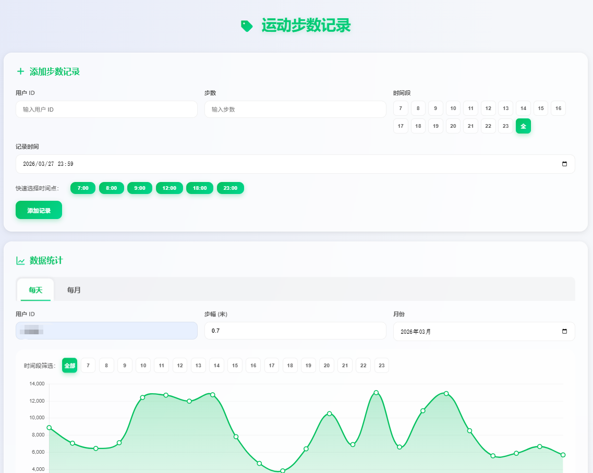
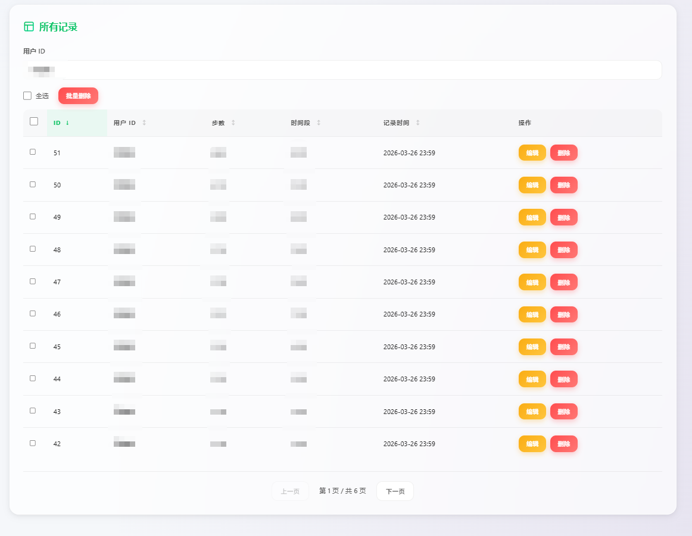
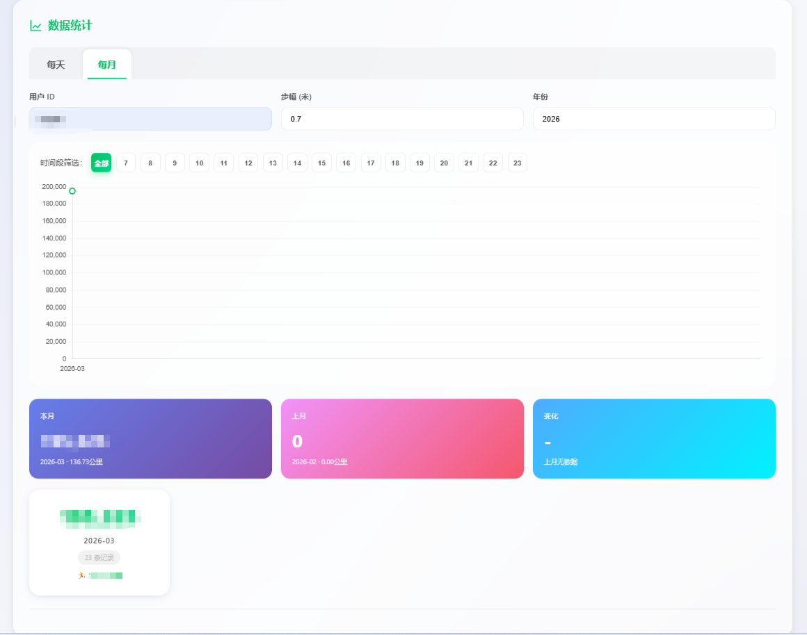

# 微信运动步数记录

一个简洁美观的微信运动步数记录管理系统，支持按小时记录、数据统计、曲线图展示、月趋势对比等功能。

## 项目截图





## 功能特性

### 核心功能
- **步数记录管理**：添加、编辑、删除步数记录
- **按小时记录**：支持 7:00-23:00 共 17 个时间段，精细追踪每天各时段活动
- **快速时间选择**：一键选择常用时间点（7:00、8:00、9:00、12:00、18:00、23:00）
- **重复数据校验**：自动检测同一时间段的重复记录，防止重复添加
- **自定义确认弹窗**：美观的弹窗样式，替换浏览器原生 confirm

### 数据统计
- **按天统计**：查看每日步数汇总和距离（每天取最大值）
- **按月统计**：查看每月步数汇总和距离（该月每天步数总和）
- **月趋势对比**：本月 vs 上月步数对比，显示增长/下降百分比
- **时间段筛选**：曲线图和统计数据可按小时筛选查看
- **曲线图展示**：直观展示步数变化趋势，支持全部/各小时切换

### 数据管理
- **批量删除**：支持勾选多条记录一次性删除
- **分页浏览**：统计数据和记录列表均支持分页
- **用户筛选**：按用户 ID 筛选查看数据
- **步数转距离**：根据自定义步幅自动计算步行距离（公里）
- **智能排序**：记录默认按 ID 降序排列，最新记录在前

### 用户体验
- **移动端优化**：响应式设计，完美适配手机和平板
- **美观界面**：现代化玻璃态设计，渐变色彩，流畅动画
- **实时反馈**：操作成功/失败即时提示
- **自定义弹窗**：替换浏览器原生 confirm，统一 UI 风格

## 技术栈

- **后端**：Node.js + Express
- **数据库**：SQLite
- **前端**：原生 HTML/CSS/JavaScript
- **图表**：Chart.js

## 安装与运行

### 1. 安装依赖

```bash
npm install
```

### 2. 启动服务器

```bash
node app.js
```

### 3. 访问应用

打开浏览器访问：http://localhost:9008

## 项目结构

```
Run_Records/
├── app.js              # Express 应用主文件
├── database.js         # 数据库初始化与操作
├── package.json        # 项目依赖配置
├── run_records.db      # SQLite 数据库文件（自动创建，已添加到 .gitignore）
├── public/
│   ├── index.html      # 前端页面
│   └── favicon.svg     # 网站图标
├── screenshots/        # 项目截图目录
└── README.md           # 项目说明文档
```

## 使用说明

### 添加步数记录

1. 输入用户 ID
2. 输入步数
3. 选择时间段（7 点 -23 点，或留空表示全天）
4. 选择记录时间（可使用快速时间点按钮）
5. 点击"添加记录"

**重复检测**：如果同一用户、同一天、同一时间段已有记录，系统会弹出自定义确认弹窗，提示是否覆盖。

### 查看统计

#### 每天视图
1. 在"数据统计"区域输入用户 ID
2. 选择月份
3. 可设置步幅（默认 0.7 米）以计算步行距离
4. 曲线图展示步数趋势，卡片显示详细数据（按时间倒序）

#### 每月视图
1. 切换到"每月"标签
2. 选择年份
3. 查看月趋势对比卡片：
   - **本月**：当前月份的总步数和距离
   - **上月**：上一个月份的总步数和距离
   - **变化**：相比上月增长/下降的百分比（上月无数据时显示 `-`）

#### 时间段筛选
- 在曲线图上方点击小时按钮（7-23 或全部）
- 查看该时间段的步数趋势
- 统计数据同步更新

### 管理记录

- 在"所有记录"表格中可编辑或删除已有记录
- 支持按用户 ID 筛选
- 支持分页浏览
- **批量删除**：
  1. 勾选要删除的记录（或点击全选）
  2. 点击"批量删除"按钮
  3. 确认删除

### 排序功能

点击表格表头可按该列排序：
- ID：按记录编号排序（默认）
- 用户 ID：按用户排序
- 步数：按步数多少排序
- 时间段：按小时排序
- 记录时间：按时间先后排序

## 数据说明

### 步数统计逻辑

微信运动的步数是**累计值**，不是增量值。系统采用以下统计方式：

| 统计维度 | 计算方式 | 示例 |
|---------|---------|------|
| **每天步数** | 该天所有小时记录中的最大值 | 7 点 5000 步，12 点 8000 步，18 点 10000 步 → 当天 10000 步 |
| **每月步数** | 该月所有天的步数总和 | 1 号 10000 步 + 2 号 12000 步 + ... = 月总步数 |
| **月趋势对比** | 本月总和 vs 上月总和 | 本月 300000 步 vs 上月 250000 步 → +20% |

### 距离计算

```
距离（公里）= 步数 × 步幅（米）÷ 1000
```

默认步幅 0.7 米，可在统计页面自定义修改。

### 示例数据

假设某用户 3 月份的记录：
- 3 月 1 日：7 点 5000 步，12 点 8000 步，18 点 10000 步 → **当天 10000 步**
- 3 月 2 日：8 点 6000 步，12 点 12000 步 → **当天 12000 步**
- 3 月 3 日：10 点 9000 步 → **当天 9000 步**

**3 月总步数** = 10000 + 12000 + 9000 + ...（该月所有天的步数总和）

## 默认配置

| 配置项 | 默认值 |
|--------|--------|
| 服务端口 | 9008 |
| 默认步幅 | 0.7 米 |
| 每页显示记录数 | 20 条 |
| 统计卡片每页显示 | 10 条 |
| 时间段范围 | 7:00 - 23:00 |
| 默认记录时间 | 当天 23:59 |

## 常见问题

### Q: 支持多用户吗？
A: 支持。不同用户 ID 的数据相互独立，通过用户 ID 筛选查看。

### Q: 月趋势对比为什么显示"上月无数据"？
A: 当上月没有任何记录时，变化百分比无法计算（分母为 0），会显示 `-` 和"上月无数据"。等有上月数据后会正常显示变化百分比。

### Q: 为什么每月步数是总和而不是最大值？
A: 微信运动是累计值，每月总步数应该是该月每天步数的累加，这样才能反映整月的运动量。
